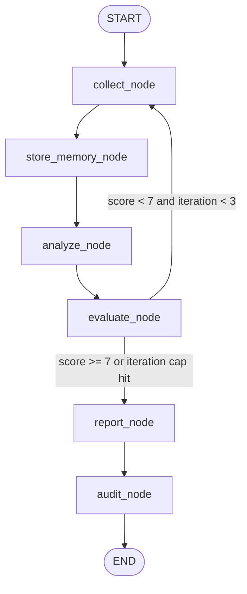

# Research Agent — Project Notes

A LangGraph state-machine agent that researches a topic, self-evaluates the
quality of its research, retries with a different search query if the score
is too low, then writes a final report.

## Architecture



| Node | File location | Job |
|---|---|---|
| `collect_node` | `skeleton_research_agent.py:168` | Web search via Tavily; changes query on retry |
| `store_memory_node` | `:179` | Saves source text into the vector store |
| `analyze_node` | `:185` | LLM summarizes each source (RAG: pulls related past research) |
| `evaluate_node` | `:193` | LLM scores research quality 1-10 (structured output) |
| `report_node` | `:199` | LLM writes the final report from all insights |
| `audit_node` | `:205` | Logs completion stats, no LLM call |
| `quality_router` | `:233` | Decides `collect` (retry) vs `report` (done) |

The `AgentState` TypedDict (`:71`) is the shared data every node reads/writes.
`execution_logs` uses a reducer (`Annotated[List[str], operator.add]`) so
every node appends to the log instead of overwriting it.

## Where things live (for extending)

- **Prompts** — built inline as f-strings in each node: `analyze_node` (`:228`),
  `evaluate_node` (`:253`), `report_node` (`:273`). No single system prompt;
  each node asks the LLM for something different.
- **Model config** — `llm = ChatOpenAI(...)` at `:142`, currently OpenRouter's
  free `nvidia/nemotron-3-super-120b-a12b:free` model, `temperature=0`.
- **Search tool** — `search_tool = TavilySearch(max_results=5)` at `:150`.
  `.invoke({"query": q})` returns a dict; sources are under `["results"]`.
- **Vector store / memory** — `vector_store` at `:152`, using
  `DeterministicFakeEmbedding` (fake, non-semantic — fine since embeddings
  only power the memory-retrieval bonus, not the core graph). Swap in real
  HuggingFace embeddings later if you want actual semantic similarity search.
- **Entry point** — `if __name__ == "__main__":` at `:389` builds
  `initial_state` (topic + empty placeholders), compiles the graph with a
  checkpointer, prints the Mermaid diagram, streams execution, then prints
  the final report + logs.

## Environment

- Python 3.12 via `.venv/bin/python` (the venv already has all
  `requirements.txt` packages + `numpy` installed).
- API keys live in `.env` (not committed anywhere): `OPENAI_API_KEY` is
  actually an OpenRouter key (`sk-or-...`), `TAVILY_API_KEY` is a Tavily key
  (`tvly-...`).

## Run it

```bash
cd /Users/afrah/Documents/simple-ai-researcher
.venv/bin/python skeleton_research_agent.py
```

Each run consumes OpenRouter's free-tier rate limit (~20 req/min) and
Tavily's monthly free credits — fine to run repeatedly, just don't loop it
tightly.

## Extending into a second file

To build on this in a new file, the reusable pieces are: `AgentState`,
`llm`, `search_tool`, `vector_store`, and the six node functions — import
them from `skeleton_research_agent.py`, or copy the pattern (define new
`TypedDict` fields, write new node functions that return partial dicts, wire
them with `workflow.add_node` / `add_edge` / `add_conditional_edges`).
